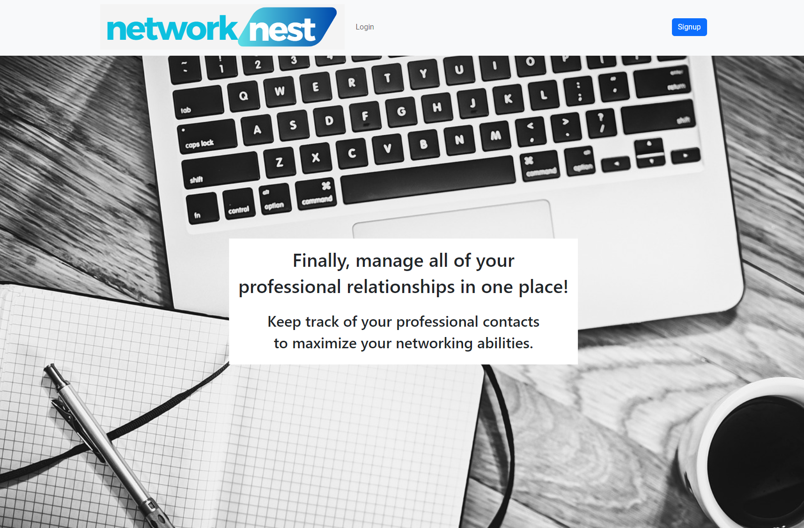
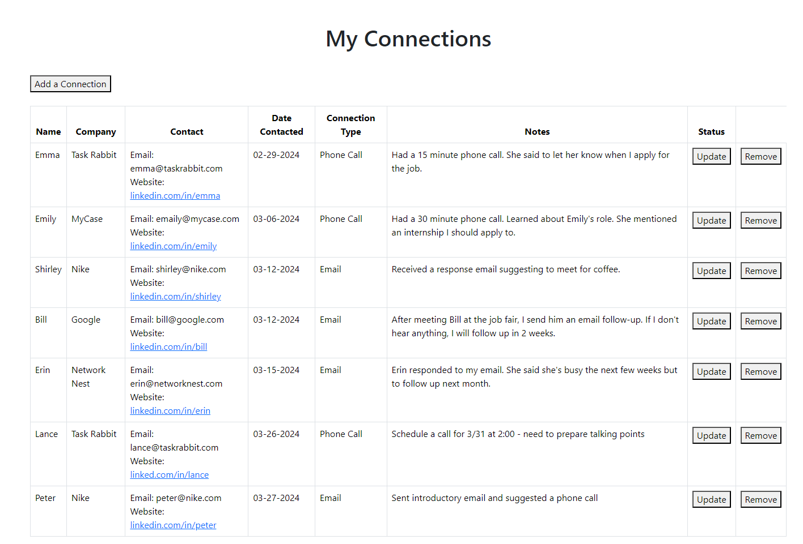
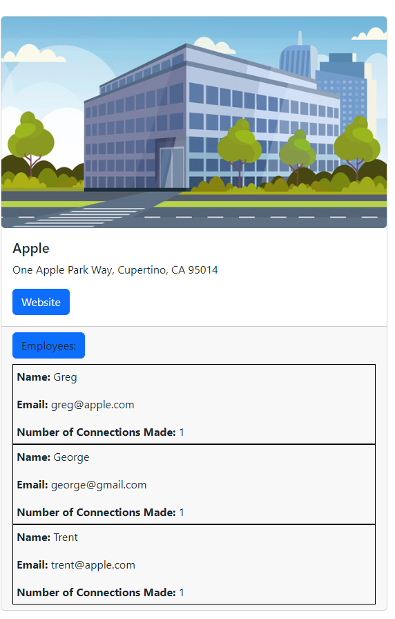

# NetworkNest - Full Stack Application

## Getting Started

To start up the server, cd into the server folder and run `python app.py`. To start up the front end, cd into the client folder and run `npm start`.

## Description

NetworkNest is a full-stack application using Flask, Python, SQLAlchemy, JavaScript and React. This app was inspired by my background working in career services and the strong emphasis we put on networking as a key tool in career exploration and the job search. Users can create an account and keep track of all of their professional contacts. This app uses a Flask API to link the React front end to the backend data.

## Features 

Users can add new connections, either from a database of existing companies and employees, or by adding new ones. As their connections change, they can update them on their homepage, or remove them if they are no longer needed. 

On the 'Companies' page, users can see all of the employees currently in the database who are associated with each company and how many connections they have made.

## Demo

